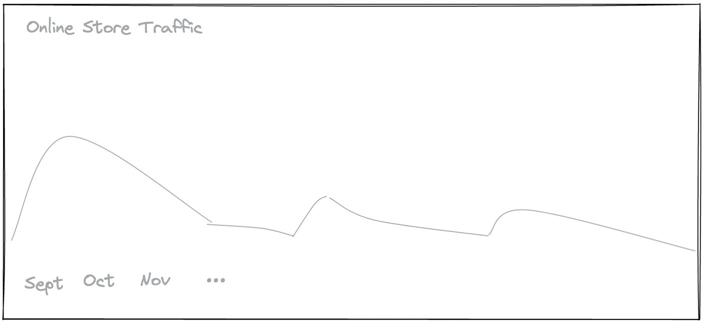
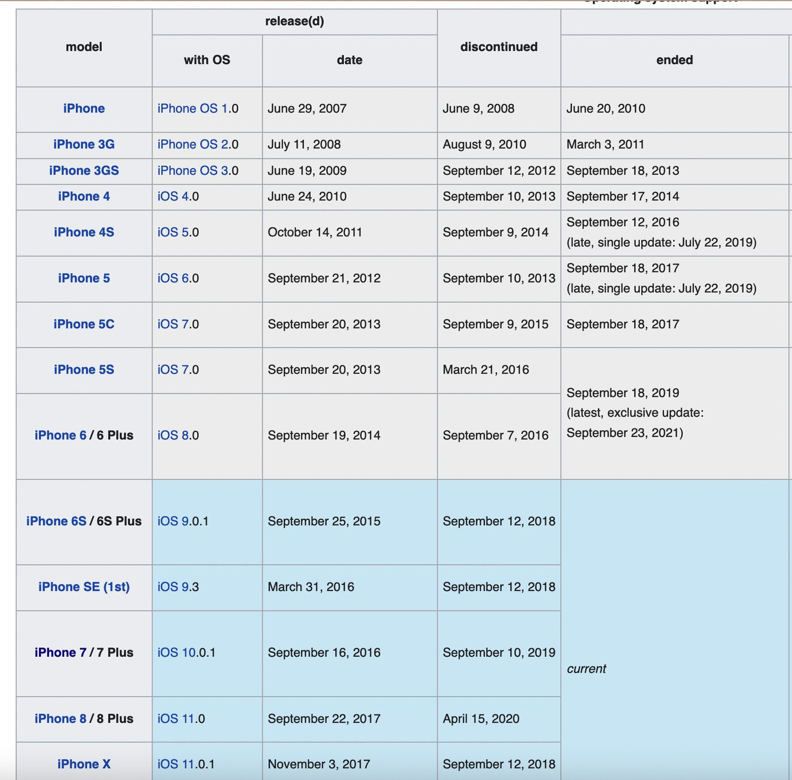
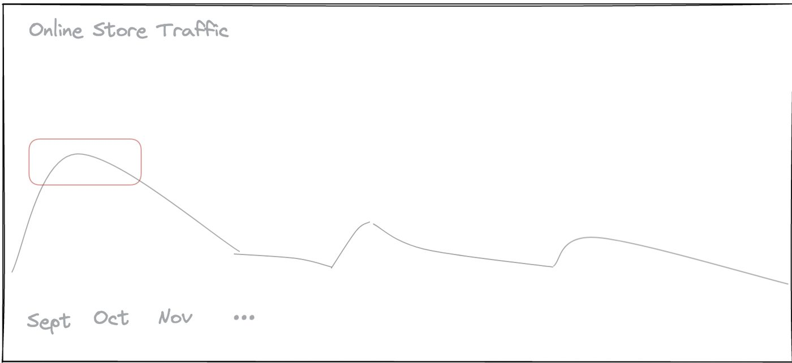

> İlk olarak 2022'de Hashnode üzerinde İngilizce olarak yayımlandı. Bu metin yazının güncellenmiş Türkçe versiyonudur.

2016 yılının yazında sırf bir iPhone satın almış olmam, ilk yazılımcılık işime kabul edilmemde şaşırtıcı bir rol oynadı. Baştan belirteyim, herhangi bir teknoloji markasının fanatiği değilim ve buradaki asıl mesele telefonun kendisi de değil. O gün yaşadığım tecrübe, bana kariyerim boyunca faydasını gördüğüm çok kıymetli bir bakış açısı kazandırdı.

## Mezuniyet dönemi

Bilgisayar mühendisliği lisans eğitimimi henüz tamamlamıştım ve İstanbul'da aktif olarak iş başvuruları yapıyordum. Süreçlerden biri oldukça olumlu ilerliyordu: Türkiye'nin önde gelen telekomünikasyon operatörlerinden birinin genç yetenek programına başvurmuştum ve beş aşamalı maratonun dördüncü adımına kadar gelmiştim:

1. Video mülakat değerlendirmesi
2. İngilizce seviye testi
3. Genel yetenek sınavı
4. Grup vaka analizi mülakatı
5. Üst yönetimle birebir görüşme ve teklif

Grup mülakatını başarıyla atlatabilirsem iş teklifini alacaktım. Bu aşama oldukça dinamik bir formata sahipti: Bir masa etrafında toplanan 8-10 adaya gerçek bir iş vakası veriliyor, herkesten senaryoyu dikkatle inceleyip somut bir strateji önermesi bekleniyordu.

## Grup mülakatı masası

Mülakat günü geldiğinde hem heyecanlı hem de hazırlıklıydım. İnternetteki benzer vaka çalışmalarını izlemiştim fakat bu tür bir ortamı ilk kez canlı tecrübe edecektim. Odada süreci izleyen 4-5 değerlendirici (daha sonra çoğunun üst düzey yönetici olduğunu öğrendim) ve masanın etrafında 8-10 aday vardı. Önümüze iki sayfalık kapsamlı bir vaka metni bırakıldı. İlk sayfada satış trendlerini gösteren grafikler, ikinci sayfada pazar dinamikleri ve metnin sonunda bizden çözmemiz istenen temel soru vardı. Grafikler genel hatlarıyla şu yapıdaydı:

Sayfada ayrıca kullanıcıların demografik kırılımları ve pazar payı eğilimleri gibi ek veriler de sunulmuştu.

**Soru**: Dijital satış kanalımızın gelirlerini artırmak için hangi stratejileri önerirsiniz?
**Görev**: Fikrini savun, masadaki diğer adayları ikna et. Aynı zamanda diğer önerileri yapıcı bir dille sorgula ve sağlam temellere dayanıp dayanmadığını test et.
**Bağlam**: Şirket internet paketleri, telefon aksesuarları, kulaklıklar, tabletler ve akıllı telefonlar satıyordu.

## Tartışma süreci

Bireysel düşünme süresi dolduğunda masada hararetli bir beyin fırtınası başladı. Adaylar sırayla söz alarak klasik önerileri sıralamaya koyuldu:

* SIM kart aboneliklerinin yanında cihaz aksesuarlarında cazip indirimler tanımlamalıyız
* SMS paketlerini kısıp daha uygun fiyatlı mobil veri paketleri öne sürmeliyiz
* Sadakat programı üyelerine özel kuponlar dağıtmalıyız

Önümdeki kağıda çok fazla madde karalamamıştım ama aklımda tek bir belirgin detay vardı. Mezuniyetten bir yıl önce babam ve arkadaşlarının düzenlediği bir ABD seyahatine katılma şansım olmuştu. Dönem eylül ayıydı ve Apple yeni iPhone 6S modelini henüz duyurmuştu.

Washington'daki Apple mağazasına gittiğimizde kapıda sokaklar boyunca uzanan devasa kuyruğu ilk kez kendi gözlerimle gördüm. İnsanların bu çılgınlığını merak edip araştırdığımda Apple'ın geleneksel lansman takvimini ve tüketicilerin her sonbaharda yeni modeller için nasıl organize olduğunu öğrenmiştim. Yukarıdaki tabloda da görüldüğü üzere iPhone lansmanları düzenli olarak eylül ve ekim dönemlerine denk geliyordu.

Mülakat masasına geri dönelim. Önümüzdeki satış grafiğinde sonbahar aylarında belirgin bir tepe noktası göze çarpıyordu. Tam o anda zihnimde bir şimşek çaktı:

***İnsanlar bu dönemde dijital mağazaya yeni iPhone için özel bir tarife veya taksit kampanyası var mı diye bakıyor olabilir miydi?***

Söz sırası bana geldiğinde doğrudan bu gözlemimi paylaştım:

* Apple her yıl düzenli olarak eylül ayında yeni cihazlarını tanıtıyor. Önümüzdeki satış grafiğindeki ani yükseliş tam da bu lansman takvimiyle örtüşüyor. Tüketicilerin bu dönemde online mağazaya en çok yeni iPhone kampanyalarını incelemek için geldiği anlaşılıyor. Dolayısıyla pazarlama bütçesini ve ana sayfa vitrinini bu aya özel iPhone paketlerine ayırmak satışı katlayacaktır.

O ana kadar sessizce not alan yöneticilerden ikisi başlarını kaldırıp belirgin bir ilgiyle birbirine baktı. Mülakat bittiğinde masadaki diğer adaylardan bazıları yanıma gelip "teklifi kesin sen alacaksın" dediler.

Nitekim birkaç gün sonra şirketten teklif geldi ve yazılım kariyerime backend mühendisi olarak ilk adımı atmış oldum.

## Temel çıkarım

* Kendinizi yalnızca önünüze konan dar veri setiyle sınırlandırmayın. Sorunu çözerken kendi hayat tecrübelerinizden, farklı alanlardaki gözlemlerinizden ve dış dünyadaki dinamiklerden beslenin.
* Yaşadığınız her tecrübeden ders çıkarmaya bakın. Karşınıza çıkan ipuçlarının doğrudan kodlama veya bilgisayar mühendisliğiyle ilgili olması gerekmez.

