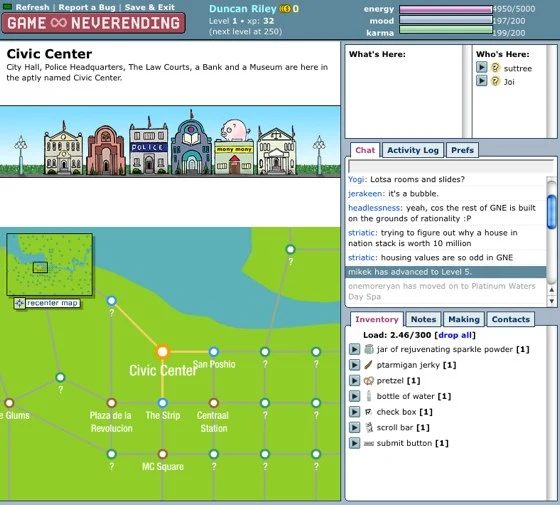
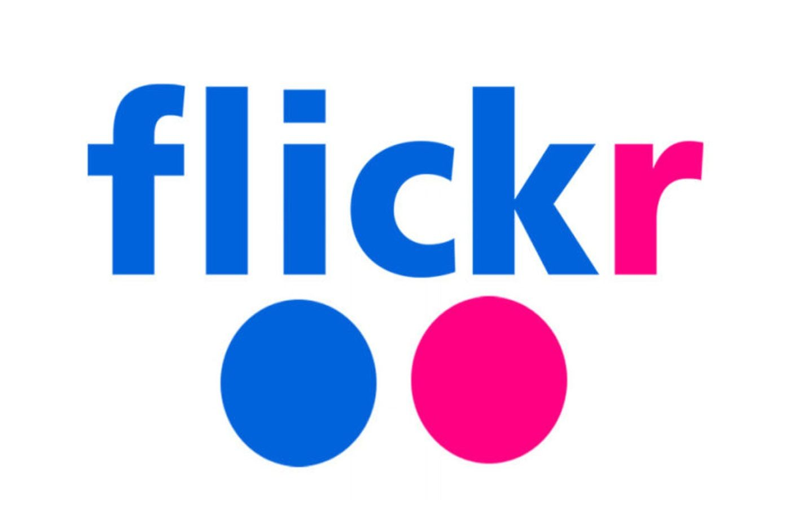
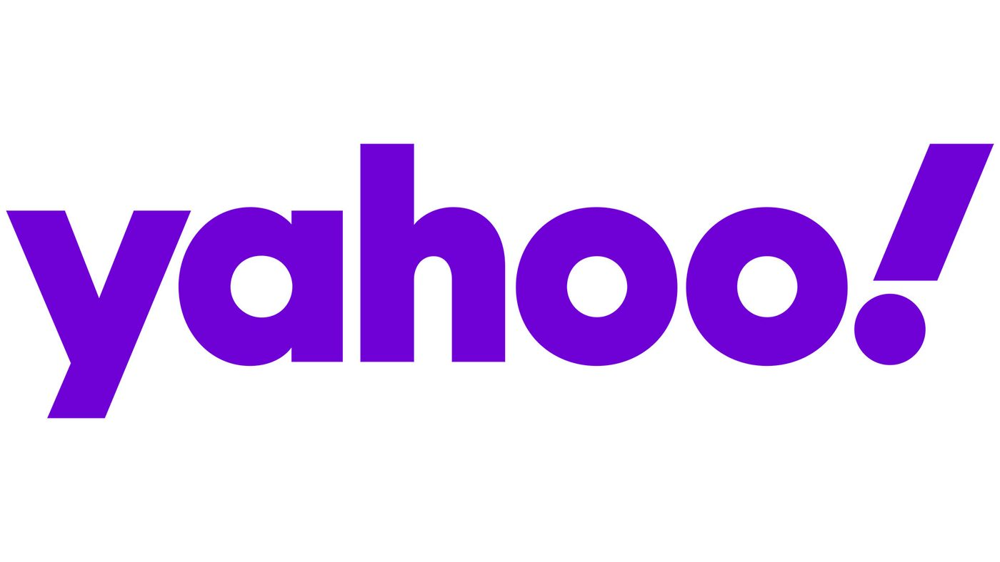
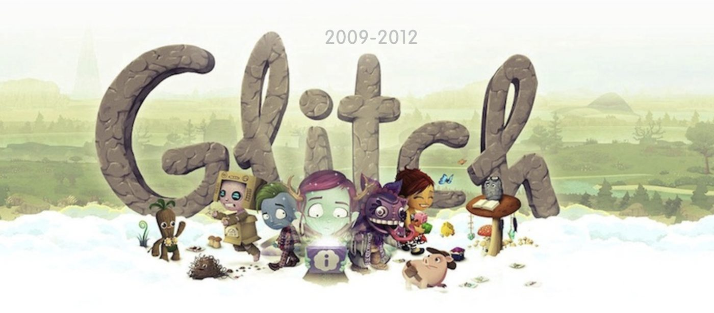
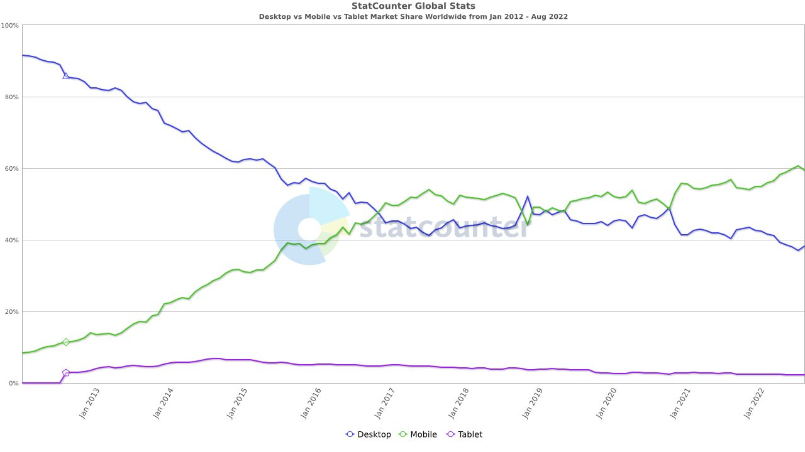
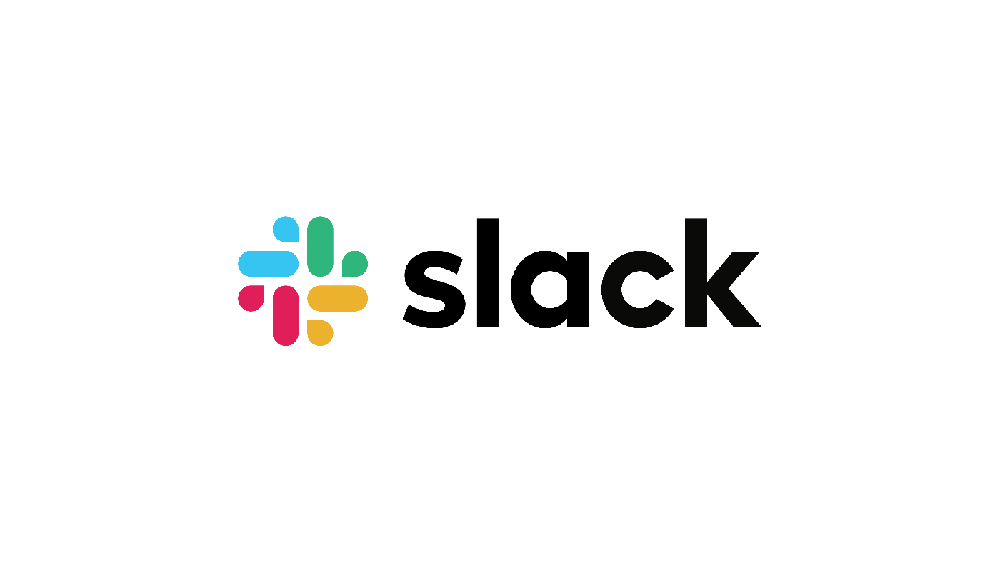
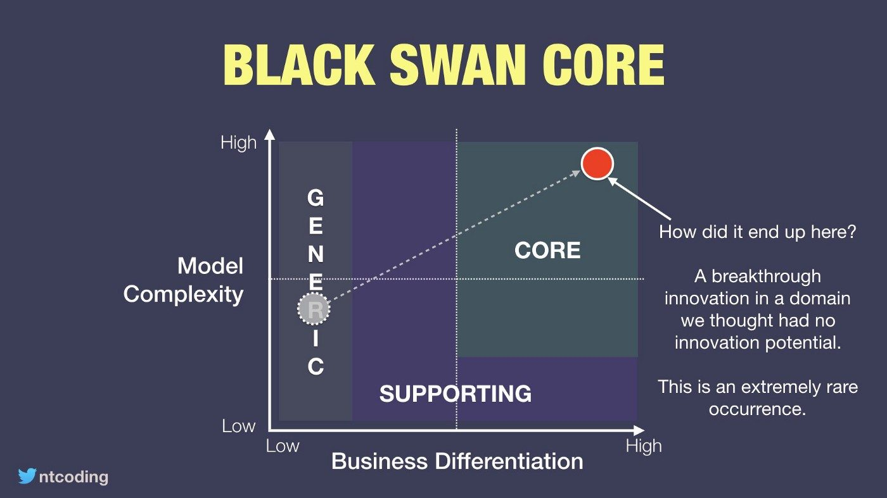

> İlk olarak 2022'de Hashnode'da İngilizce yayımlandı. Bu, yazının Türkçe
> çevirisi; metne dokunulmadı, görseller artık kendi sunucumuzda.

Tanınmış bir girişimin hikâyesini özetleyip bu dersten aldığım notları
paylaşacağım.

Bu yazıyı yumuşak bir caz eşliğinde okuyabilirsin:

[▶ Slack Huddle bekleme müziği — YouTube](https://www.youtube.com/watch?v=uLMD_u41GlA)

## Birinci deneme: Game Neverending

[Ludicorp](https://web.archive.org/web/20040202160253/http://www.ludicorp.com/the_team.php?width=900)
adlı oyun şirketinin kurucu ortağı Stewart Butterfield, 2002'de ekibiyle
birlikte tarayıcı tabanlı çok oyunculu bir oyun geliştiriyor.

Oyunun dönemine göre basit ama cesur bir konsepti var:

* Nesne üret
* Nesneleri mizah için değiştir
* Gömülü sohbet üzerinden sosyalleş; mesaj ve görsel gönder

Bu oyunda kazanmanın bir yolu yok, sadece başkalarıyla oynamanın keyfini
çıkarıyorsun: ["Game Neverending"](https://gamicus.fandom.com/wiki/Game_Neverending). Ama çok uzun süre tutunamadı.

## Kapanış: Game Neverending

Oyun [2004'te](https://techcrunch.com/2008/04/02/game-neverending-rises-from-the-dead/)
ömrünü tamamladı. Ama ekip, oyunun iç iletişiminde kullandıkları araçlardan
birini elinde tuttu.

## İkinci deneme: Flickr

Oyuncular Game Neverending içinde görsellerini yükleyip birbirleriyle
paylaşıyordu. Ekip bu aracı yeni bir servise dönüştürdü: Flickr.

Flickr, görsellerini yükleyip etiketleyebildiğin, gruplayıp
paylaşabildiğin bir görsel barındırma servisi olarak çıktı. O dönem Google'ın
Blogger'ı da popülerdi ama görsel saklamana izin vermiyordu; bu da insanları
blog yazılarında paylaşmak için görsellerini Flickr'a yüklemeye yönlendirdi.

Bu, Flickr'ın büyümesini patlattı ve küresel şirketlerin dikkatini çekti.

## Yahoo!'ya satış: Flickr

Yahoo, 2005'te Flickr'ı ve Ludicorp ekibini
[25 milyon dolara](https://www.theguardian.com/technology/2018/apr/23/flickr-bought-by-smugmug-yahoo-breakup)
satın aldı — bazı kaynaklar 35 milyon diyor, kesin rakamı doğrulayamadım.

Ama bu dev kurumsal yapı girişimci ruha iyi gelmedi. Stewart 2008'de,
mecazlarla dolu
[ilginç bir mektupla](https://www.businessinsider.com/stewart-butterfield-epic-resignation-letter-2014-8)
Yahoo'dan ayrıldı.

## Üçüncü deneme: Glitch

Stewart Butterfield kaldığı yerden devam etmek için Tiny Speck adında bir
oyun şirketi kurdu. Artık kendisi ve ekibi yatırımcılar tarafından
tanındığı için 2010'da 5 milyon, 2011'de 10 milyon dolar yatırım almak kolay
oldu.

Oyun [Glitch](https://www.glitchthegame.com/), Game Neverending'e çok benzer
bir konsepte sahip: [fantastik karakterler](https://www.youtube.com/watch?v=vuDYhczbqEQj)
ve gelişmiş bir kullanıcı deneyimi. Yine Adobe Flash Player üzerinde çalışan
bir MMORPG.

Ekip ayrıca çalışma kültürleri için gerekli olan bir iç iletişim aracı da
geliştirdi. Geliştiriciler ülkenin farklı yerlerine dağılmıştı ve eşzamansız
ama etkili bir iletişim yoluna ihtiyaçları vardı. Ayrıca bütün iletişimin
ekipteki herkese görünür olması gerekiyordu; böylece bir konunun çözümü
klasik e-posta-cc-ilet-yanıtla döngüsünden daha hızlı çıkıyordu. Buna birazdan
döneceğiz.

## Kapanış: Glitch

Oyun yine [iş tarafında iyi gitmedi](https://www.failory.com/cemetery/glitch) ve
[2012'de kapanacağı duyuruldu](http://web.archive.org/web/20121119062458/http://www.glitch.com/closing/#3).

Stewart [röportajında](https://www.gamedeveloper.com/business/the-story-of-i-glitch-i-why-this-odd-mmo-is-shutting-down#.ULkcf4P-EsQ)
başarısızlığın birkaç sebebini sayıyor:

- Yeni oyuncuların ilgisini çekmek zordu
- Mobil kullanım yayılıyordu, bu da tarayıcı tabanlı oyunlar için zor günler demekti
- Flash'tan mobile geçmek için bütçe yetersizdi

Müşteri davranışını 2012-2021 arası masaüstü ve mobil kullanım için
[statcounter](https://gs.statcounter.com/platform-market-share/desktop-mobile-tablet/worldwide/#monthly-201201-202208)
üzerinden de doğruladım. Glitch'in kapandığı yıl, tarayıcı tabanlı oyunun
hâkimiyetinin son anıydı; sonrasında mobil kullanım dünyada düzenli olarak
yayıldı.

## Dördüncü deneme: Slack

Az önce bahsettiğim iç iletişim aracını hatırlıyor musun? Tiny Speck ekibinin
ekip üyeleriyle senkron kalmak için bir iletişim aracına ihtiyacı vardı. O
dönem IRC, e-posta, Yammer, Hipchat gibi alternatifler vardı ama
[Stewart'a göre](https://techcrunch.com/2013/08/14/say-hello-to-slack-the-newest-enterprise-social-network-and-the-latest-effort-from-flickr-co-founder-stewart-butterfields-tiny-speck/)
Slack, ekiplerin verimli çalışmak için ihtiyaç duyduğu bir şey sunuyordu.

Tiny Speck ekibi kendi iç araçlarıyla ne kadar verimli çalıştıklarını fark
etti ve nerede çalışırlarsa çalışsınlar bu şekilde devam etmek istedi.
Rakiplerle karşılaştırıldığında:

* IRC'de o dönem eşzamansız mesajlaşma (sonra dönüp mesajlarını görme veya arama) yoktu
* E-posta hantal ve şeffaf değil
* Microsoft'un Yammer'ı seni Office 365 kullanmaya zorluyor
* Hiçbirinde işle ilgili bütün dokümanlarla — Docs, Excel, Github — entegre olabileceğin merkezî bir yönetim yok

Böylece "linefeed"i geliştirdiler, 2013'te adını SLACK koydular:
*Searchable Log of All Communication and Knowledge*.

## Başarı: 27,7 milyar dolarlık şirket

Bu uzun ve zorlu yolculuğun sonunda Tiny Speck (sonradan [Slack](https://nira.com/slack-history/)) ekibi kendi iç
araçlarıyla [başarıya ulaştı](https://www.singlegrain.com/casestudies/growth-study-slack-the-fastest-business-app-growth-in-history/).

Temmuz 2020
[istatistiklerine](https://www.businessofapps.com/data/slack-statistics/)
göre Slack'in 18 milyon aktif kullanıcısı ve 902 milyon dolar yıllık geliri
vardı; aynı yıl Slack,
[Salesforce tarafından](https://slack.com/blog/news/salesforce-completes-acquisition-of-slack)
**27,7 milyar dolara** satın alındı (işlem 2021'de tamamlandı).

## Siyah Kuğu teorisi

**Siyah Kuğu teorisi**: Elimizdeki veriyi yorumlayarak öngörülemeyen ve
şaşırtıcı etkisi olan olay. Bu terim çoğunlukla ekonomide kullanılıyor —
nadiren gerçekleşen ama pandemi gibi yıkıcı sonuçlar doğuran krizler ya da
küresel olaylar için. Doğada siyah kuğular nadir görüldüğü için teoriye bu
ad verilmiş.

Nick Tune, Domain Driven Design eğitiminde ve
[*Core Domain Patterns* yazısında](https://medium.com/nick-tune-tech-strategy-blog/core-domain-patterns-941f89446af5)
Siyah Kuğu'yu ilginç bir şekilde kullanıyor:

Çok fazla karmaşıklık gerektirmeyen ve net bir iş ayrımı yaratmayan bir
özellik, nadiren de olsa işinin çekirdek özelliği haline gelebiliyor.

## Çıkarım

Slack'in hikâyesinde daha fazla ayrıntı var: pazar araştırması, geri bildirim
ve iyileştirme döngüleri, iş yöntemleri. Bunu bir yanılsama gibi göstermek
istemedim; popüler başarı hikâyelerinden çok daha fazla başarısızlık olduğunu
da biliyorum. Ama motivasyona ihtiyaç duyan ya da ilham alacak bir örnek
arayan insanlar var ve bu hikâyeler işe yarayabiliyor — en azından bende
yarıyor.

* Battın mı? Neyi iyi yaptığının farkına var (Game Neverending -> Flickr)
* Başardın mı? Hayalin için yeni bir fırsat (Flickr -> Glitch)
* Sıkıldın mı? Hayalin için işten ayrıl (Glitch -> Slack)
* Rekabet mi var? Hedef kitleni belirle (Slack -> milyar dolar)

> Zor seçimler kolay hayat, kolay seçimler zor hayat

## Bonus

Başta önerdiğim müziği dinledin mi? Slack'in yeni özelliği Huddle'ın
(Slack içindeki hızlı toplantı odası) bekleme müziği — ve o müzik, batan
(gerçekten mi?) oyunları Glitch'ten geliyor.

